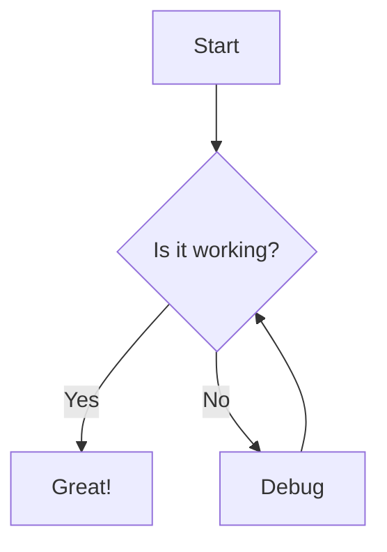

## Adding Images

### Basic Image Syntax

```markdown

```

### Using HTML img Tag

For more control, use the HTML `` tag:

```html

```

## Image Theming

Display different images for light and dark themes:

```jsx


```

## Image Organization

Organize your images in the `/images` folder:

```
/images
  /screenshots
    - dashboard.png
    - settings.png
  /diagrams
    - architecture.svg
    - flow.svg
  /icons
    - logo.svg
    - favicon.png
```

## Image Formats

Mintlify supports various image formats:

- **PNG** - Best for screenshots and images with transparency
- **JPG/JPEG** - Best for photographs
- **SVG** - Best for logos, icons, and diagrams (scalable)
- **WebP** - Modern format with better compression
- **GIF** - For simple animations

## Responsive Images

Make images responsive with CSS classes:

```html

```

## Image Captions

Add captions to your images:

<Frame>
  
</Frame>

*Figure 1: Example screenshot showing the dashboard*

## Frames

Use the `<Frame>` component to add borders and styling to images:

<Frame>
  
</Frame>

<Frame caption="Screenshot with caption">
  
</Frame>

## Video Embeds

### YouTube

```html
<iframe
  width="560"
  height="315"
  src="https://www.youtube.com/embed/VIDEO_ID"
  title="YouTube video player"
  frameBorder="0"
  allow="accelerometer; autoplay; clipboard-write; encrypted-media; gyroscope; picture-in-picture"
  allowFullScreen
></iframe>
```

### Loom

```html
<div style={{
  position: 'relative',
  paddingBottom: '56.25%',
  height: 0
}}>
  <iframe
    src="https://www.loom.com/embed/VIDEO_ID"
    frameBorder="0"
    style={{
      position: 'absolute',
      top: 0,
      left: 0,
      width: '100%',
      height: '100%'
    }}
  ></iframe>
</div>
```

## Diagrams

### Mermaid Diagrams



## Icons

Use icons from popular icon libraries:

<Icon icon="star" />
<Icon icon="heart" />
<Icon icon="check-circle" />

## Image Optimization Tips

<AccordionGroup>
  <Accordion title="Compress images">
    Use tools like TinyPNG or ImageOptim to reduce file sizes without losing quality
  </Accordion>

  <Accordion title="Use appropriate formats">
    - Use SVG for logos and icons
    - Use WebP for better compression
    - Use PNG for screenshots
    - Use JPG for photographs
  </Accordion>

  <Accordion title="Lazy loading">
    Mintlify automatically lazy loads images for better performance
  </Accordion>

  <Accordion title="Alt text">
    Always provide descriptive alt text for accessibility
  </Accordion>
</AccordionGroup>

## Best Practices

<Tip>
  Store images in a dedicated `/images` folder for better organization
</Tip>

<Note>
  Use descriptive filenames for your images (e.g., `user-dashboard.png` instead of `img1.png`)
</Note>

<Warning>
  Keep image file sizes under 500KB for optimal loading times
</Warning>
